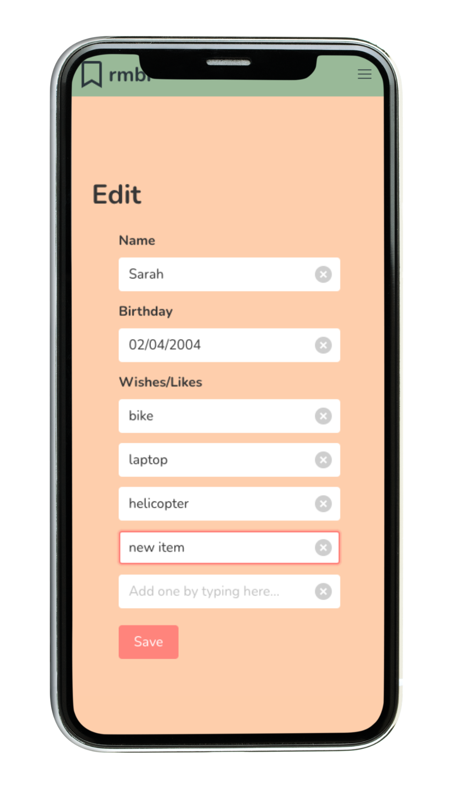

##  General Assembly, Software Engineering Immersive
# Project 4: Full-stack app with Python Flask RESTful API

# Rmbr Assistant
Made by [Florian Wilisch](https://github.com/florian-wilisch) and [Adam Lee Osgood](https://github.com/adwam12).

## Overview
The final project at GA was to create a full-stack web application. This two-person, week-long project utilised a Python Flask RESTful API. Rmbr Assistant was born out of the idea that gift shopping for individuals is so hard. Everytime we think of a good gift idea, we forget about it by the time a birthday comes up. We wanted to create a **mobile-first voice assistant** that could keep track of the  likes and hobbies of an individual and remind you of them a month before a birthday.

Link: [Rmbr](https://flows-project-4.herokuapp.com/)

## Technologies
* HTML
* CSS / SASS
* Bulma
* JavaScript (ES6)
* React
* Python
* Flask
* Google Dev Tools
* Auth 2.0
* Git and GitHub
* Marshmallow
* PostgreSQL
* SQLAlchemy
* TablePlus
* [Google Natural Language API](https://cloud.google.com/natural-language/)
* [React Vocal](https://github.com/untemps/react-vocal)

## Requirements
​
* Build a full-stack application by making your own backend and your own front-end
* Use a Python Flask API using a Flask REST Framework to serve your data from a Postgres database
* Consume your API with a separate front-end built with React
* Be a complete product which most likely means multiple relationships and CRUD functionality for at least a couple of models
* Implement thoughtful user stories/wireframes that are significant enough to help you know which features are core MVP and which you can cut
* Have a visually impressive design to kick your portfolio up a notch and have something to wow future clients & employers. ALLOW time for this.
* Be deployed online so it's publicly accessible.
* A working app hosted on the internet
* A link to your hosted working app in the URL section of your Github repo
* A git repository hosted on Github, with a link to your hosted project, and frequent commits dating back to the very beginning of the project

## Planning
The first step of the process was to plan and outline all the desired features. We separated them into MVP (minimal viable product) and stretch goals. We then kept track of this document for a to-do list and to record bug fixes and our progress.


## Challenges & Solutions
### Inner workings
It was important to us that the user could submit their query in "free form" (i.e. not having to follow a particular pattern or fill in pre-defined fields). So, for example, both these sentences should work:
* “Anna ist born on the 4th of May 1998, and she wants a bike“ 
* “Mike wants a Harry Potter Book for his birthday on the 18th of March”

We found the *Google Natural Language API* to be perfect for categorizing different words in a sentence into names, dates, objects, interests etc. We could feed it a string, and it would return an array with each word categorized. We could then take this string and format the info to fit our backend models:

```	
	  useEffect(() => {
	    for (let i = 0; i < natLangResult.length; i++) {
	      const element = natLangResult[i]
	      if (element['type'] === 'PERSON') {
	        setCurrentContact(element['name'])
	      }
	      if (element['type'] === 'EVENT') {
	        if (element['name'] === 'birthday') {
	          setCurrentEvent(element['name'])
	          requestType.push('BIRTHDAY')
	        }
	      }
	      if (element['type'] === 'DATE') {
	        let day = element['metadata']['day']
	        let month = element['metadata']['month']
	        let year = ''
	        if ((element['metadata']['year'])) {
	          year = element['metadata']['year']
	        }
	        if (Number(element['metadata']['day']) < 10) {
	          day = '0' + element['metadata']['day']
	        }
	        if (Number(element['metadata']['month']) < 10) {
	          month = '0' + element['metadata']['month']
	        }
	        if (year === '') {
	          setCurrentBirthday(day + '/' + month)
	          setBirthdayDay(day)
	          setBirthdayMonth(month)
	        } else {
	          setCurrentBirthday(day + '/' + month + '/' + year)
	        }
	      }
	      if ((element['type'] === 'CONSUMER_GOOD') || (element['type'] === 'WORK_OF_ART') || (element['type'] === 'OTHER')) {
	        wantsList.push(element['name'])
	      }
	    }
	    if (wantsList.length > 0) {
	      setCurrentWant(wantsList)
	    }
	  }, [natLangResult])
```

The above code was the starting point for any request. It checks what type of request was just made, and runs the appropriate function for each item in the request. Below is an example for adding a wish ("want") to a users contact:

```	
	  function addContactWant(id, want) {
	    axios.get(`/api/contacts/${id}`, {
	      headers: { Authorization: `Bearer ${token}` }
	    })
	      .then(resp => {
	        const currentWant = resp.data['wants']
	        for (let i = 0; i < want.length; i++)
	          if (currentWant.includes(want[i]) === false) {
	            currentWant.push(want[i])
	          }
	        axios.put(`/api/contacts/${id}`, {
	          'name': resp.data['name'],
	          'wants': currentWant
	        }, {
	          headers: { Authorization: `Bearer ${token}` }
	        })
	        if ((wantsList.length > 1) || (currentWant.length > 1)) {
	          setPrint(`Added multiple items to ${capitalizeFirstLetter(resp.data['name'])}'s Wishlist/Likes`)
	        } else {
	          setPrint(`Added ${want[0]} to ${capitalizeFirstLetter(resp.data['name'])}'s Wishlist/Likes`)
	        }
	      })
	  }
```

All of this worked perfectly to keep track of our contacts, creating new ones if necessary, and keeping track of each contacts interests/wishes. 

The pseudo code was quite simple: 

* If we detect a name in the string check if its a name already in our contact list
	* if true, and string contains a 'want' or birthday, add it to that contact info
	* if false, create contact and if string contains a 'want' or birthday, add it to that contact info

We then added a library to record voice and use that audio to create a string. This gives the user the option of either typing his request, or dictating it to the assistant. 

### EditContact.js

When a user chooses to edit a contact, they come to a page where they can delete or update the information we have saved for this specific contact. 

It was important to us that users could also add a new wish/like manually by typing it into and empty field. This should then in turn create a new empty field for the next item, and if an empty item gets deselected only one empty field should remain.



This was achieved by creating a separate array for the new items with an empty value at the end. This array is then merged with the previously saved wishes/likes just before sending the array to our database.

```
const [newWants, setNewWants] = useState([''])

function addWantField(event) {
    if (!event.target.value) {
      const data = [
        ...newWants
      ]
      data.push('')
      setNewWants(data)
    }
  }
   
function handleSubmit(event) {
    event.preventDefault()
    console.log(event)
    const token = localStorage.getItem('token')

    newWants.splice(newWants.indexOf(''), 1)
    const initialWants = contactData.wants
    const finalWants = initialWants.concat(newWants)
    const finalData = {
      ...contactData,
      wants: finalWants
    }
    console.log(finalData)
    axios.put(`/api/contacts/${contactId}`, finalData, {
      headers: { Authorization: `Bearer ${token}` }
    })
      .then(() => {
        props.history.push('/account')        
      })
  }
  
return [...]

      {newWants.map((w, i) => {
          return <div key={i} className='field '>            
            <div className="control has-icons-right">
              <input
                className='input'
                type="text"
                onFocus={addWantField}
                onBeforeInputCapture
                onChange={(event) => {handleNewWantsChange(event, i)}}
                // defaultValue={contactData.wants[i]}
                value={newWants[i]}
                name={newWants[i]}
                placeholder='Add one by typing here...'
              /><span 
                className='icon is-right'>
                <i className='delete' onClick={() => {emptyString(`newWants[${i}]`)}}></i>
              </span>
            </div>
          </div>
        })}
  [...]
```


### Error handling

This being our first project using Python and Flask, we had to get our head around how error handling is managed with this setup. It turns out it's quite a bit more manual than with mongoose.

```
@router.route('/signup', methods=['POST'])
def signup():
  request_body = request.get_json()
  username = User.query.filter_by(username=request_body['username']).first()
  if username:
    return { 'message': 'This username already exists. Please choose another one.'}, 400
  find_email = User.query.filter_by(email=request_body['email']).first()
  if find_email:
    return { 'message': 'This email is already registered. Please go to login.'}, 400
  email = request_body['email']
  match = re.search(r'\b[A-Z0-9._%+-]+@[A-Z0-9.-]+\.[A-Z]{2,}\b', email, re.I)
  if not match:
    return { 'message': 'Please use a valid email address.'}, 400
  user = user_schema.load(request_body)
  user.save()
  return user_schema.jsonify(user), 200
```


## Wins and Takeaways
* Learned to use the Google APIs (Natural Language API)
* Learned to implement and use an SQL database
* Learned to create an edit-page, dynamically adding new fields as items are being added 
* Learned error handling on the login & register pages via Python

## Future Features
* Adding reminders that aren't linked to a person ("remind me to do laundy")
* Adding family connections (buy a gift for Elliot's daughter)
* Adding last names
* Adding reminder functionality for non-Google-Calendar users (email reminders or other)

## Screenshots
 
 